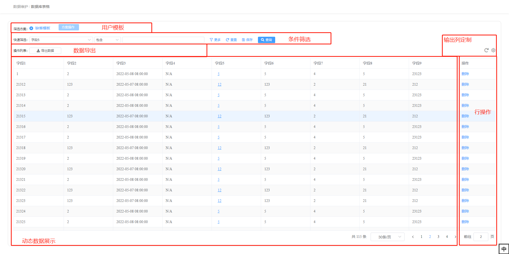
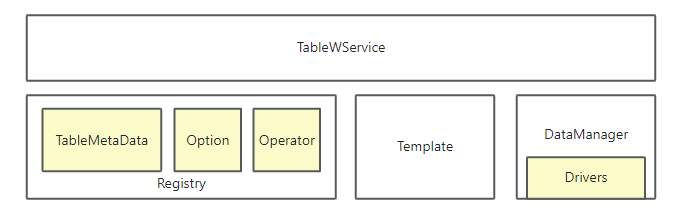
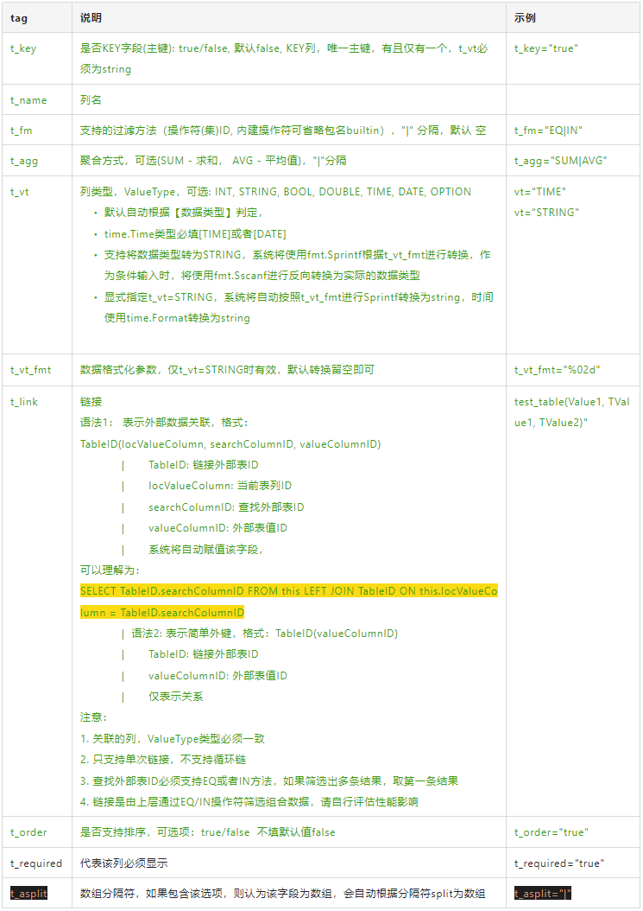

# 0 需求与 Web 接口

## 0.1 需求



## 0.2 web 接口

webproto/cap/table_wservice.proto

- 筛选条件
- 输出定制
- 用户模板
- 动态数据展示
- 数据导出
- 行操作

# 1 框架

## 1.1 模块图



## 1.2 模块功能说明

| **模块**      |                | **说明**                                                                               |
| ------------- | -------------- | -------------------------------------------------------------------------------------- |
| TableWService |                | 为前端提供的报表 grpc 服务                                                             |
| Registry      |                | 注册表，维护表格静态数据                                                               |
|               | /TableMetaData | 表格元数据注册表，维护所有表格元数据(描述表格数据的数据，包括名字，结构，支持的筛选等) |
|               | /Option        | 选项注册表，维护枚举信息                                                               |
|               | /Operator      | 操作符注册表，维护所有支持的操作符                                                     |
| Template      |                | 用户模板(主要是用户定制的筛选/输出方案)                                                |
| DataManager   |                | 数据管理                                                                               |
|               | /Drivers       | 数据驱动，实现数据获取的方法                                                           |

# 2 开发一个报表

## 2.1 准备

## 2.2 Option 选项

- Option 是数据表中引用的一些常量，在代码中一般以枚举的形式实现
- OptionID：唯一标记一组选项的 ID，格式应该为 "package.OptionName"并全局唯一
- Option 的数据结构

```go
package cap

type OptionValue struct {
	Id                   int32
	Name                 string
}
```

- 注册一个 Option

```go
import "framework/pkg/table/registry"

//***********************************************************************
options := []*OptionValue{....}
err := registry.GlobalTableRegistry().OptionReg.Register("optionID", options)
if err != nil {
	return err
}
```

- 查询 Option

```go
import "framework/pkg/table/registry"

//***********************************************************************
// 查询所有的选项
options, err := registry.GlobalTableRegistry().OptionReg.GetOptions("optionID")
if err != nil {
	return err
}
// 查询单个选项
option, err := registry.GlobalTableRegistry().OptionReg.LookUp(1)
if err != nil {
	return err
}
```

- 使用 Protobuf 定义的枚举自动生成 Option
  - 在 proto 中引入扩展，增加名字

```protobuf
// webproto/extension
import "extension/enum.proto";

enum SectionType {
  ST_Step_1 = 0 [ (extension.option_name) = "第一步" ];
  ST_Step_2 = 1 [ (extension.option_name) = "第二步" ];
  ST_Step_3 = 2 [ (extension.option_name) = "第三步" ];
  ST_Step_4 = 3 [ (extension.option_name) = "第四步" ];
  ST_Step_5 = 4 [ (extension.option_name) = "第五步" ];
  ST_Step_6 = 5 [ (extension.option_name) = "第六步" ];
}
```

```go
import "framework/pkg/table/registry"
//***********************************************************************

// 先加载，再注册
enumOpt, err := registry.LoadOptionFromProtoEnum(dict.SectionType(0))
if err != nil {
	return err
}
err = registry.GlobalTableRegistry().OptionReg.Register(enumOpt.TypeID, enumOpt.Options)
if err != nil {
	return err
}

// 或者 直接注册
err = registry.RegisterOptionFromProtoEnum(dict.SectionType(0))
if err != nil {
	return err
}
// 注册成功的OptionID = package.EnumName
```

## 2.3 Operator 操作符

- 操作符是用户筛选报表的条件操作符
- 操作符 ID：唯一标记一个操作的 ID，格式应该为 "package.OptionName"并全局唯一，"builtin"包固定为内建操作符，外部无法使用
- 操作符与操作符集结构

```go
type OperatorNode interface {
	ID() string
	Name() string
}

// Operator 操作符
type Operator interface {
	OperatorNode
    // 右值类型，0个，单个，多个
	FilterValueType() cap.FilterValueType
}

// OperatorSet a set of operators
type OperatorSet interface {
	OperatorNode
	Operators() []Operator
}

```

- 内建操作符

内建操作符位于"framework/pkg/table/operator/builtin"，声明了大部分常用的数据库操作符与操作符集，操作符用于数据查询，需要在下文中的“数据驱动”中做对应实现

- 自定义操作符

```go
// 使用内建方法可以注册自定义操作符，在“数据驱动”中自行实现
builtin.RegisterOperator(...)
```

## 2.4 Metadata 元数据

- Metadata 是报表的元数据，描述了报表的结构
- 元数据(表)ID：唯一标记一个报表的 ID，格式应该为 "package.OptionName"并全局唯一
- Metadata 结构

```go
// 报表元数据
type TableMetaData interface {
	ID() string
	Name() string
	Desc() string
	ExportFilePrefix() string
	// Columns 获取所有的列
	Columns() *TableColumnDescriptorList
	// Print 打印文档
	Print(io.Writer)
	// DefaultTemplate
	DefaultTpl() *cap.Template
	// 获取Key列ID
	KeyColumnID() string
	// 校验模板合法性
	ValidateTpl(*cap.Template) error
}

// 列描述符
type TableColumnDescriptor struct {
	// 列id，在表中的唯一标记
	ID string
	// 列名，用户可读
	Name string
	// DataType 数据类型
	DataType reflect.Type
	// ValueType 在表格中展示的类型
	ValueType cap.ValueType
	// ValueFormat ...
	ValueFormat string
	// 支持的筛选类型，长度为0代表不支持筛选
	SupportedFilters []Operator
	// 支持的聚合方法，长度为0代表不支持聚合
	SupportedAggregateMethod []cap.AggregateMethod
	// 关联
	Link *ColumnLink
	// TODO...
	Internal bool
	// Other tags
	Tag reflect.StructTag
	// 是否支持排序
	Orderable bool
	// 是否Key列
	IsKeyColumn bool
}
```

- 从数据结构生成 Metadata
  - 通过定义数据结构以及 Tag，可以声明一个表格，并且自动生成 Metadata
  - 数据结构只支持单层 kv，基础数据类型(intxx/string/double/float/enum)
  - Tag 说明



- 示例

```go
// TableExample 示例表格
type TableExample struct {
	Value1 string    `t_name:"测试1" t_key:"true" t_fm:"EQ|NE|IN" `
	Value2 int       `t_name:"测试2" t_fm:"EQ|NE|GE"`
	Value3 bool      `t_name:"测试3"`
	Value4 time.Time `t_vt:"DATE" t_link:"test_table(Value1, TValue1, TValue2)"`
	Value5 int       `t_vt:"INT" t_vt_fmt:"%02d" t_fm:"SINT" t_agg:"SUM|AVG"`
	Value6 int       `t_vt:"INT" t_link:"test_table(Value1)"`
}
```

- 使用数据库表生成数据结构
  - 更新 cap 至最新版本

```bash
cd jihulab.com/ycwjck/metal-backend/pkg/cmd/cap
go install
```

- 使用 cap 创建表格对应的数据结构

```bash
cap -t2g -tts -dsn \
"root:root@tcp(localhost:3306)/cap?charset=utf8" \
-p packageName -of output.go -tn tableName
# 运行成功会生成对应的数据结构及tag，再进行人工编辑定制即可
# 注意: COMMENT需要使用格式，"字段名|字段描述"，生成表格后，字段名会自动编程t_name
```

- 注册 Metadata

```go
// 先注册依赖的选项
registry.RegisterOptionFromProtoEnum(omsdict.SectionType(0))
// 使用数据结构创建metada
tmd, err := registry.LoadTMDFromStruct(&Material{})
if err != nil {
	panic(err)
}
// 注册metadata
registry.GlobalTableRegistry().TableMetaReg.Register(tmd)
err = data.GlobalManager().RegisterDriver(tmd.ID(), &MaterialDriver{})
if err != nil {
	panic(err)
}
```

## 2.5 DataDriver 数据驱动

- 数据驱动是获取数据内容的实现
- DataDriver 接口

```go
// RowsResult 结果
type RowsResult struct {
	Rows       []interface{}         // 返回数据行列表，支持数据结构指针数组，或*cap.TableRow数组
	AggResults []*AggregateResult    // 聚合结果
	PageInfo   *cap.PageInfo         // 分页信息
}

// Driver ...
type Driver interface {
	FindRows(
		ss            *mysql.Session,            // ss: 数据库会话
		tmd           registry.TableMetaData,    // tmd: 表格元数据
		conditions    []*Condition,              // conditions: 筛选条件
        outputColumns []string,                  // outputColumn: 期望输出列
                                                 // 期望输出的列必须有数据，其他列可有可无
                                                 // 可用于优化查询
		aggCols       []*AggregateColumn,        // aggCols: 聚合列
		pageParam     *cap.PageParam,            // pageParam: 分页参数
		orderParam    *cap.OrderParam,           // orderParam: 排序参数
	) (result *RowsResult, err error)
}


// 所有参数均根据Metadata声明进行了校验，无需过多考虑参数合法性问题
// 需要处理不支持的方法，条件右值可以直接取索引
```

- 内建 Driver

系统内建了表映射的 driver，可以实现单标基础数据类型的大部分自动查询：

```go
dddLabel := dbdriver.NewDBDriver("label")
```

- 注册 Driver

```go
import "framework/pkg/table/data"
if err = data.GlobalManager().RegisterDriver(tmdLabel.ID(), dddLabel); err != nil {
	panic(err)
}
```

## 2.6 Row Action 行操作

- 行操作类型

```protobuf
enum RowActionType {
  // 自定义，需要与前端约定自定义接口实现
  RAT_CUSTOM = 0;
  // JSON Schema表单，调用统一接口提交JSONSCHEMA表单
  RAT_JSON_FORM = 2;
}
```

- 定义行操作

```go
// 先创建metadata
tmd, err := registry.LoadTMDFromStruct(&Material{})
if err != nil {
	panic(err)
}

// MaterialUpdateForm 物料更新表单
type MaterialUpdateForm struct {
}

func (m *MaterialDeleteForm) Schema(rowData interface{}) ([]byte, error) {
}
// 添加行操作
tmd.AddRowActions(
	action.NewCustomRowAction("test1", "测试1"),
	action.NewFormRowAction("test2", "测试2",
    // Action执行器
    func(grpcCtx context.Context, ss *mysql.Session, formJSON []byte) error {
      	fmt.Println("测试2执行")
		return nil
	},
    // 表单
    &MaterialUpdateForm{},
)

// 按行过滤action，用于权限控制等场景
tmd.SetRowActionsFilter(func(grpcCtx context.Context, rowData interface{}, actionID string) (support bool) {
	return true
})
```

- 使用内建的行操作执行器

```go
// SQL执行器，SQL模板需符合text/template规则
executor := action.NewRowFormSQLExecutor(
    "UPDATE table SET col_1 = '{{.ColName}}' WHERE id = '{{.ColID}}')
```

## 2.7 示例代码

```bash
cap/table/demo
```

# 3 使用数据

## 3.1 编程接口

- 模块封装了界面实现的统一接口，编程时如能复用，也可以使用 table 模块的数据
- 注册表中的结构/选项均可直接引用访问
- DataDriver 自行创建使用，也可以使用 data.GlobalManager 访问

## 3.2 表格文档服务

- 文档服务将表格数据自动生成文档，可作为调试或与前端的协议文档

```go
// 启动注册表文档服务
doc.ServeHTTP(":8080", db)
// 访问http://localhost:8080查看文档
```

# 版本

| **版本** | **时间**  | **内容**        | **人员** |
| -------- | --------- | --------------- | -------- |
| 0.1      | 2021.1.10 | 文档框架        | 周航     |
| 0.2      | 2021.1.12 | 初版            | 周航     |
| 0.3      | 2021.1.18 | 增加 row action | 周航     |
